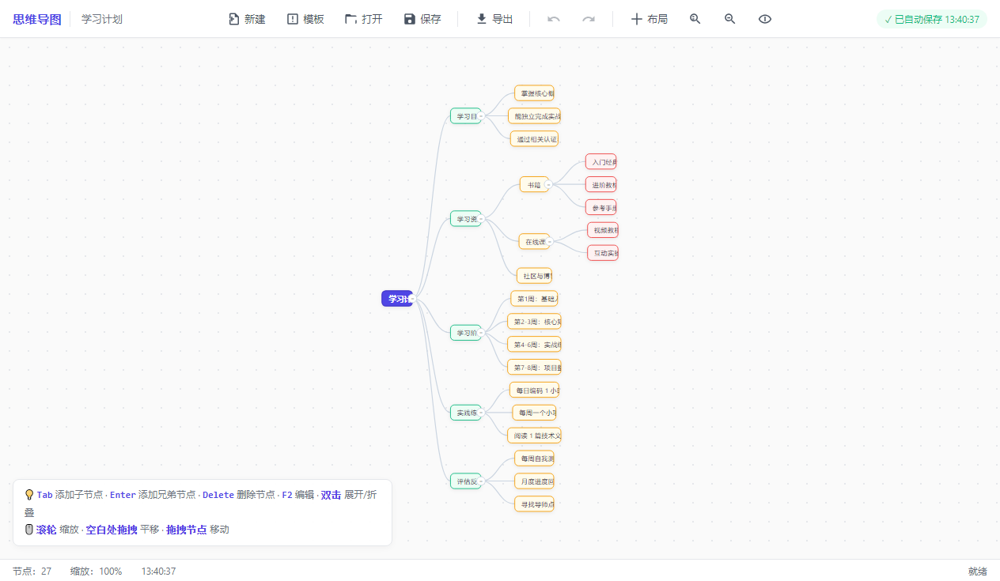

# 🧠 oh-my-MindBranch

> A modern, elegant mind mapping desktop application built with Electron.

[](LICENSE)
[](https://www.electronjs.org/)
[](#-download)
[](CHANGELOG.md)

[简体中文](#中文说明) | [English](#english)

---

## 📸 Screenshots



---

## ✨ Features

- 🎨 **Modern Design** — Clean and minimal UI inspired by XMind and MindNode
- 📝 **Full Node Editing** — Add, delete, edit, drag, fold/unfold
- 🎯 **Smart Auto-Layout** — Classic left-right tree (MindMap style)
- 🖱️ **Smooth Interactions** — Pan, zoom, drag, multi-level context menus
- 📂 **8+ Templates** — Study plan, project management, decision analysis, book notes, etc.
- 💾 **Auto-save** — Your work is always safe, never lose a thought
- 📤 **Import/Export** — JSON format and PNG image export
- ↩️ **Undo/Redo** — Full history navigation
- 🎨 **Custom Colors** — 8 preset color schemes for node customization
- ⌨️ **Keyboard Friendly** — Comprehensive shortcuts for power users
- 🌐 **Cross-platform** — Windows, macOS, Linux

---

## 📥 Download

### Windows
[**Download Installer**](https://github.com/yourname/oh-my-MindBranch/releases/latest) · `oh-my-MindBranch-Setup-1.0.0.exe`

Or check the [`dist/`](dist/) directory in this repository for pre-built binaries.

---

## 🚀 Quick Start

### Prerequisites
- [Node.js](https://nodejs.org/) 18 or later
- npm (bundled with Node.js)

### Installation

```bash
# Clone the repository
git clone https://github.com/yourname/oh-my-MindBranch.git
cd oh-my-MindBranch

# Install dependencies
npm install

# Run the app
npm start
```

### Build from Source

```bash
# Build for Windows
npm run build:win

# Build for current platform
npm run build
```

Output binaries will be in the `dist/` directory.

---

## ⌨️ Keyboard Shortcuts

| Shortcut | Action |
|----------|--------|
| `Tab` | Add child node |
| `Enter` | Add sibling node |
| `Delete` / `Backspace` | Delete node (root excluded) |
| `F2` | Edit current node |
| `Space` | Toggle collapse/expand |
| `Ctrl + Z` | Undo |
| `Ctrl + Y` | Redo |
| `Ctrl + S` | Save as JSON |
| `Ctrl + O` | Open JSON |
| `Ctrl + E` | Export as PNG |
| `Ctrl + N` | New mindmap |
| `Ctrl + L` | Re-layout |
| `Ctrl + 0` | Reset view |
| `Ctrl + =` | Zoom in |
| `Ctrl + -` | Zoom out |
| `Ctrl + Shift + O` | Show in file manager |
| `Alt + ↑ / ↓` | Move node up/down |
| `Alt + Shift + ↑ / ↓` | Move node to top/bottom |

### Mouse

- **Click** — Select node
- **Double-click** — Edit text
- **Double-click + button** — Collapse/expand children
- **Drag node** — Move position
- **Drag empty area** — Pan canvas
- **Scroll wheel** — Zoom in/out (anchored at cursor)
- **Right-click** — Context menu

---

## 📚 Built-in Templates

| Template | Use Case |
|----------|----------|
| 📋 Blank Document | Free creation |
| 📚 Study Plan | Plan a systematic learning path |
| 🚀 Project Management | Complete project planning framework |
| ⚖️ Decision Analysis | Rational decision making |
| 📖 Book Notes | Structured reading notes |
| 🗂️ Meeting Minutes | Record meeting points and action items |
| 💡 Product Planning | From user insights to product roadmap |
| 📅 Weekly Plan | Work-life balance |
| 🧠 Brainstorm | Generate ideas around a topic |

---

## 🏗️ Tech Stack

- **[Electron](https://www.electronjs.org/)** 32 — Desktop application framework
- **HTML5 / SVG** — Vector graphics rendering
- **Vanilla JavaScript** (ES6+) — No build step needed
- **[electron-builder](https://www.electron.build/)** — Package and distribute

---

## 📁 Project Structure

```
oh-my-MindBranch/
├── main.js                  # Electron main process
├── preload.js               # Secure preload script
├── package.json             # Project configuration
├── src/
│   ├── index.html           # Main window HTML
│   ├── styles/
│   │   └── main.css         # Main stylesheet
│   ├── js/
│   │   ├── mindmap.js       # Data model
│   │   ├── templates.js     # Template library
│   │   ├── layout.js        # Auto-layout algorithm
│   │   ├── renderer.js      # SVG rendering engine
│   │   ├── interaction.js   # Mouse/keyboard interactions
│   │   ├── storage.js       # LocalStorage + history
│   │   ├── export.js        # Import/export
│   │   ├── contextMenu.js   # Right-click menu
│   │   └── app.js           # Main controller
│   └── assets/
│       ├── icon.svg         # Vector source
│       ├── icon.png         # 256×256
│       ├── icon-512.png     # 512×512 (HiDPI)
│       └── icon.ico         # Windows multi-size
└── dist/                    # Build output (after `npm run build`)
```

---

## 📄 License

[MIT](LICENSE) © 2024 zcode

---

# 中文说明

> 一个基于 Electron 的现代简洁思维导图桌面应用。

## ✨ 特性

- 🎨 **现代设计** — 参考 XMind 和 MindNode 的简洁界面
- 📝 **完整节点编辑** — 增删改、拖拽、折叠展开
- 🎯 **智能自动布局** — 经典左右展开式（MindMap 风格）
- 🖱️ **流畅交互** — 平移、缩放、拖拽、多级右键菜单
- 📂 **8+ 模板** — 学习计划、项目管理、决策分析、读书笔记等
- 💾 **自动保存** — 永不错过任何想法
- 📤 **导入导出** — JSON 格式和 PNG 图片
- ↩️ **撤销/重做** — 完整历史导航
- 🎨 **自定义颜色** — 8 种预设配色方案
- ⌨️ **键盘友好** — 丰富的快捷键支持

## 📥 下载

### Windows
[**下载安装包**](https://github.com/yourname/oh-my-MindBranch/releases/latest) · `oh-my-MindBranch-Setup-1.0.0.exe`

或查看本仓库 [`dist/`](dist/) 目录中的预编译二进制。

## 🚀 快速开始

### 环境要求
- [Node.js](https://nodejs.org/) 18 或更高版本
- npm（Node.js 自带）

### 安装

```bash
# 克隆仓库
git clone https://github.com/yourname/oh-my-MindBranch.git
cd oh-my-MindBranch

# 安装依赖
npm install

# 运行应用
npm start
```

### 从源码构建

```bash
# 构建 Windows 版本
npm run build:win

# 构建当前平台版本
npm run build
```

构建产物会输出到 `dist/` 目录。

---

## 🙏 Acknowledgments

Inspired by [XMind](https://xmind.app/), [MindNode](https://mindnode.com/), and [百度脑图](https://naotu.baidu.com/).

Built with ❤️ using [Electron](https://www.electronjs.org/).

---

<p align="center">
  <sub>If you find this project useful, please consider giving it a ⭐️!</sub>
</p>